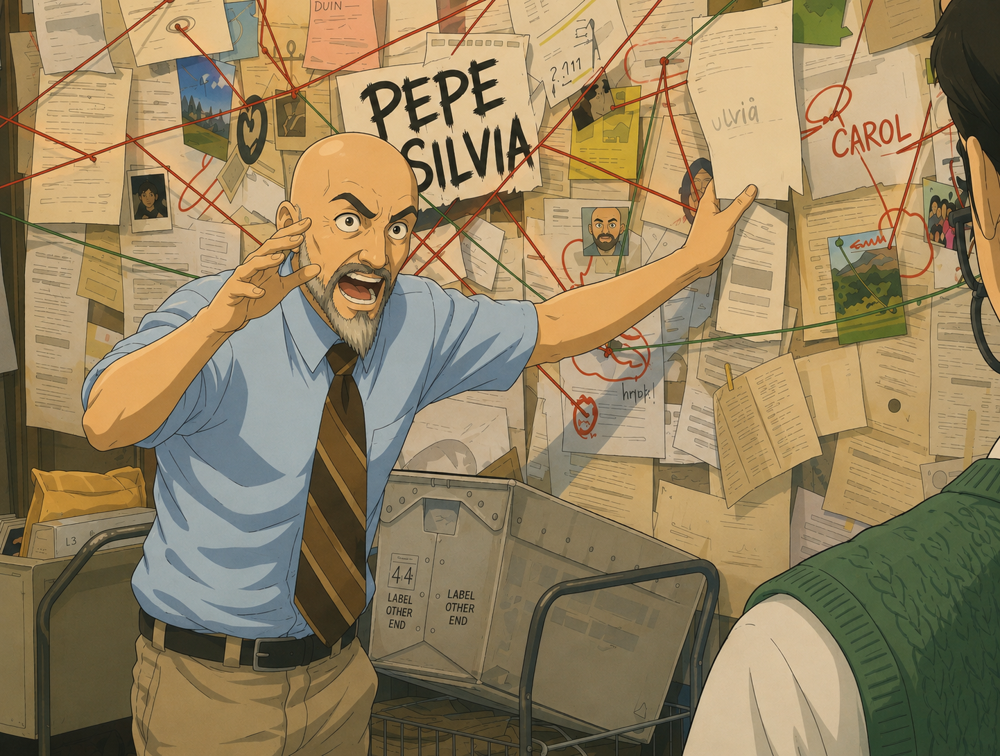

# About me
I'm passionate about software development, and infrastructure, with a strong focus on **security and automation**.
Programmatically solving problems is what I like to do best.

**Python** 🐍 is my primary language of choice, and I'm a fan of its community and how it allows one to solve complex problems quickly.

I also enjoy working with **Golang** for its simplicity and ease of deployment as it allows the creation of small self-contained binaries that can be shipped in very minimal container images. That is of course on top of the fact that it bundles a really powerful standard library.

## Recommendations & Work History
View them directly [on LinkedIn](https://www.linkedin.com/in/agu3rra).

## Spoken Languages
- 🇧🇷 Brazilian Portuguese: native
- 🇬🇧 English: fluent
- 🇪🇸 Spanish: intermediate
- 🇩🇪 German: basic

## Graphs
Yes, I love graphs and I build them in my head, my Neo4j's, and of course my [Obsidian](https://obsidian.md) vault.
